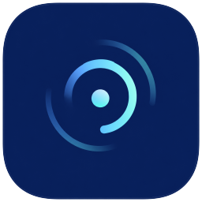
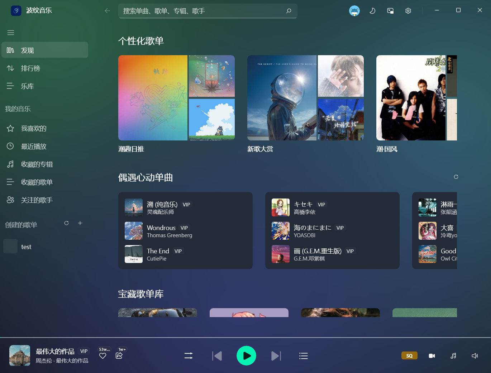
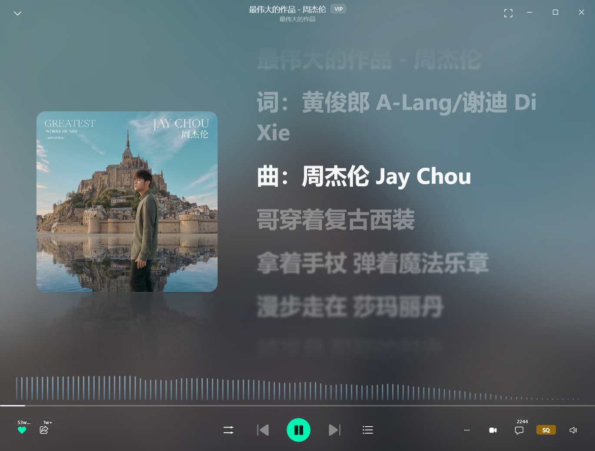

<div align="center">



# 波纹音乐

**非官方波点音乐桌面客户端：WinUI 3 + libmpv，把官方 PC 端没做的评论、收藏歌单补上，并把播放状态交给系统。**

[](LICENSE)
[](https://github.com/ldm0715/bowen_music/releases)
[](#-下载安装)

基于 WinUI 3（Windows App SDK）+ .NET 10 + libmpv 构建

</div>

<p align="center">
  
  <br/>
  <sub><b>主界面</b> —— 侧栏曲库、歌曲列表工具栏与底部播放器</sub>
</p>
<p align="center">
  
  <br/>
  <sub><b>全屏歌词</b> —— 逐字渐变高亮、真实音频频谱与封面倒影</sub>
</p>

## 为什么做这个

官方 PC 端缺评论、缺收藏歌单，播放状态也不对系统暴露 —— Lyricify 这类歌词工具因此读不到在放什么。

这个项目用 WinUI 3 + libmpv 自己做一个：补齐评论与收藏，并把播放状态通过 SMTC 交给系统媒体面板。

## ✨ 特性

- **系统媒体控制（SMTC）** —— 播放状态、进度、封面与歌词交给系统媒体面板，第三方歌词工具能正常读到；开始菜单快捷方式带独立 AUMID，不与官方客户端互相顶掉
- **登录与多账号** —— 手机号与扫码两种登录；记住多个账号、侧栏一键切换，切号不重新认证（凭据用 DPAPI 加密落盘）
- **未登录也能用** —— 不登录即可进外壳浏览、搜索、试听；登录框可随手关掉，等碰到评论、收藏、自建歌单这类需要身份的功能再引导登录
- **全屏沉浸歌词** —— 透明封面背景、逐字渐变高亮、弹簧滚动、长音效果、真实音频频谱与封面倒影；支持点歌词跳转、滚轮浏览，播放时操作栏自动收起
- **桌面歌词** —— 独立的悬浮歌词条：悬停浮出控制、固定字形逐字高亮、双行对齐、鼠标穿透、锁定、拉伸与屏幕边缘吸附
- **MV 播放** —— 曲目行角标、「更多」菜单、播放条三处入口；全窗沉浸播放，四种画面比例，看 MV 时自动暂停音频、退出后恢复
- **评论与回复** —— 看、发、赞、回复；楼层主题标识、数量角标、面板内图片缩放与拖动
- **四处收藏／关注** —— 歌曲、歌单、专辑、歌手都是两态按钮，取消操作先弹确认；侧栏里「收藏的歌单」与「收藏的专辑」分作两项
- **播放队列** —— 顺序播放 / 列表循环 / 列表随机三种模式并记住选择；右侧抽屉可切歌、删单曲、清空，另有「下一首播放」与「加入播放队列」两条入口
- **列表工具栏与多选** —— 歌曲列表页右上角统一提供「全部加入播放列表 / 多选 / 刷新」，多选后可批量加入喜欢、加入歌单
- **三档音质** —— 标准 / HQ / SQ 随手切换，播放器上只显示档位名；更高档位依赖官方手机客户端，本客户端不提供
- **小窗与托盘** —— 透明圆角迷你播放器、贴边自动收起；关闭到托盘、单实例运行，重复启动会唤出已有窗口
- **轻量音频栈** —— 自建精简 libmpv，音频库从 115.22 MiB 裁到 **7.97 MiB**（−93.1%），只保留解码与输出必需的部分；无需额外安装播放器或编解码包

## 📦 下载安装

前往 [**Releases**](https://github.com/ldm0715/bowen_music/releases/latest) 页面下载最新版本：

| 文件 | 说明 |
| --- | --- |
| `BowenMusic_x.y.z_x64_setup.exe` | 安装版：NSIS 安装向导，自动创建开始菜单与桌面快捷方式（推荐） |
| `BowenMusic_x.y.z_x64_portable.zip` | 便携版：解压即用，适合免安装场景 |

**系统要求**：Windows 10 2004（内部版本 19041）或更高 / Windows 11，**x64**。暂不支持 ARM64。

| 产物 | 压缩包 | 解压后 | 需要先装 .NET？ |
| --- | --- | --- | --- |
| 安装版 `..._x64_setup.exe` | 49.8 MiB | 189.8 MiB | 不需要 |
| 自包含便携版 `..._x64_portable.zip` | 69.7 MiB | 189.8 MiB | 不需要 |
| 无运行时便携版 `..._x64_noruntime_portable.zip` | **37.0 MiB** | 113.3 MiB | **需要 .NET 10 运行时（x64）** |

**怎么选**：

- 不确定就下**安装版** —— 它自带运行时，装完直接能用。
- 已经装过 .NET 10 运行时、或者只想下个小包带走，就用**无运行时便携版**，体积少一半
- 缺运行时时双击会弹出提示并给出下载链接。

每个安装包的 SHA-256 校验和列在 Release 说明末尾的表格里，可用以下命令核对：

```powershell
certutil -hashfile BowenMusic_x.y.z_x64_setup.exe SHA256
```

## 🚀 快速上手

1. **登录** —— 右上角头像进登录页，手机号或扫码任选；不想登录就直接浏览，功能会按可用状态置灰并说明原因
2. **找歌** —— 顶部搜索框回车出综合结果，「更多」进分类页签；搜索框里还能翻热榜与本地搜索历史
3. **听歌** —— 列表里点一首歌即追加到队尾并开始播放，队列里原有的歌都留着；底部播放栏五键（播放模式 · 上一首 · 播放 / 暂停 · 下一首 · 播放列表）
4. **看歌词** —— 点播放栏封面进全屏歌词页；桌面歌词在**设置 → 歌词**里打开，是一个独立的悬浮条
5. **整理** —— 歌曲列表右上角「多选」后可批量加入播放列表、加入喜欢、加入歌单；「我喜欢的」与自建歌单里还能批量移出

### 应用内快捷键

| 快捷键 | 功能 |
| --- | --- |
| `Space` | 播放 / 暂停 |
| `Ctrl+←` / `Ctrl+→` | 上一首 / 下一首 |
| `Ctrl+↑` / `Ctrl+↓` | 音量 + / 音量 − |
| `Ctrl+M` | 静音开关 |
| `Ctrl+L` | 收藏当前歌曲 |

## 🗂 数据与隐私

- 数据只在本机：`%LOCALAPPDATA%\Bowen`（会话、设备标识、设置、缓存、日志）。卸载不影响你的音乐库
- 会话凭据与记住的账号用 **Windows DPAPI 加密**，只能由当前 Windows 用户解密
- **无遥测、无日志上报**：日志只写本地文件，不会外发
- 仅有的联网行为：
  - 访问本客户端对接的音乐服务（播放、搜索、评论、收藏）
  - 检查更新：向 GitHub Releases API 查最新版本号（**设置 → 关于** 可手动触发；查到新版本只会打开浏览器，不静默下载安装）
  - 拉取封面图片

## ⚠ 已知限制

- **下载功能尚未实现**（计划中）。官方 PC 端有下载，这个客户端暂时没有，别期待
- 更高音质档位依赖官方手机客户端，本客户端只提供标准 / HQ / SQ 三档
- 仅 x64。ARM64 需要另做原生库与构建配置
- 不打包、不分发官方客户端的任何二进制；音源授权完全由服务端接口裁决，客户端不绕过任何权限

## 🛠 从源码构建

**环境要求**：Windows 10 2004+ · [.NET 10 SDK](https://dotnet.microsoft.com/download)（`10.0.400` 或更高的 Feature Band）· Windows SDK `10.0.26100` · Visual Studio 2022 的 MSVC C++ 生成工具

```powershell
git clone https://github.com/ldm0715/bowen_music.git
cd bowen_music

# 构建与单测（客户端工程 + 全部离线测试，零真实网络请求）
dotnet build Bodian.sln -c Debug
dotnet test  --project tests/Bodian.Core.Tests/Bodian.Core.Tests.csproj

# 启动。unpackaged 运行：Windows App SDK 随包，.NET 用系统运行时
./src/Bodian.WinUI/bin/Debug/net10.0-windows10.0.26100.0/win-x64/Bodian.WinUI.exe
```

`libmpv-2.dll` 已随仓库提供（`libmpv/`），克隆后直接可以播放。它是自建的精简版，重建与回退方式见 [`docs/libmpv-audio-build.md`](docs/libmpv-audio-build.md)。

## 📄 许可证与依赖

波纹音乐以 [GPL-3.0](LICENSE) 协议开源，© 2026 gcnanmu。

本项目基于以下开源项目构建，感谢这些社区：

| 项目 | 说明 | 许可 |
| --- | --- | --- |
| [mpv / libmpv](https://github.com/mpv-player/mpv) | 音频引擎。使用自建的精简音频构建，源码版本与构建脚本随仓库提供 | GPL-2.0+ |
| [Windows App SDK](https://github.com/microsoft/WindowsAppSDK) | WinUI 3 运行时与控件 | MIT |
| [.NET](https://github.com/dotnet/runtime) | 运行时与基础库 | MIT |
| [Win2D](https://github.com/microsoft/Win2D) | 歌词的逐字渲染（XAML 的 `TextBlock` 没有逐字定位 API） | MIT |
| [CommunityToolkit.Mvvm](https://github.com/CommunityToolkit/dotnet) | MVVM 源生成器 | MIT |
| [H.NotifyIcon](https://github.com/HavenDV/H.NotifyIcon) | 系统托盘（unpackaged 应用只能走 Win32 Shell_NotifyIcon） | MIT |
| [QRCoder](https://github.com/codebude/QRCoder) | 扫码登录的二维码本地渲染 | MIT |
| [NAudio](https://github.com/naudio/NAudio) | WASAPI 输出设备监听 | MIT |
| [Serilog](https://github.com/serilog/serilog) | 本地文件日志 | Apache-2.0 |
| [Fluent System Icons](https://github.com/microsoft/fluentui-system-icons) | 界面图标 | MIT |

完整依赖清单见 [`src/Directory.Packages.props`](src/Directory.Packages.props)。

## 非官方声明

本项目是**个人学习用途的非官方第三方客户端**，与波点音乐官方无任何关联，未获其授权或认可。

- 不打包、不分发官方客户端的任何二进制（含 `libmpv-2.dll`、图标、文案）
- 不含遥测与日志上报
- 音源授权完全由服务端接口裁决，客户端不绕过任何权限
- 请通过官方渠道支持正版

---

更多设计文档与逆向勘查记录见 [`docs/`](docs/)，开发环境说明见 [`docs/dev-environment.md`](docs/dev-environment.md)。

## 致谢

感谢 [Linux.do](https://linux.do/) 社区的所有成员，是你们的真诚、友善、团结、专业让这个社区充满活力。
